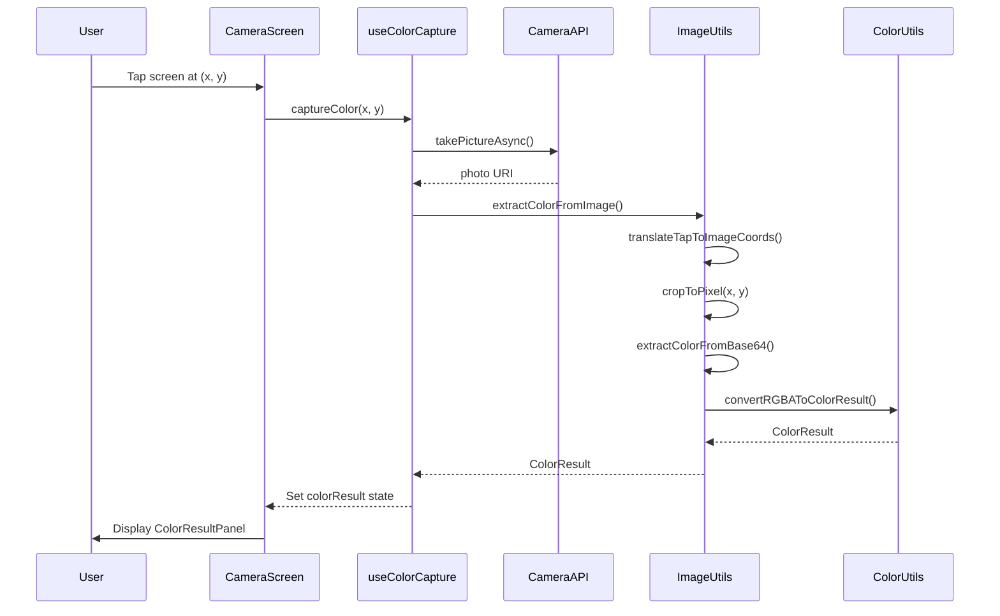

# HueGrab Technical Documentation

## Table of Contents

1. [Architecture Overview](#architecture-overview)
2. [Technology Stack](#technology-stack)
3. [Project Structure](#project-structure)
4. [Core Components](#core-components)
5. [Data Flow](#data-flow)
6. [Color Extraction Algorithm](#color-extraction-algorithm)
7. [API Reference](#api-reference)
8. [Testing Strategy](#testing-strategy)
9. [Build & Deployment](#build--deployment)
10. [Performance Optimization](#performance-optimization)
11. [Troubleshooting](#troubleshooting)

---

## Architecture Overview

HueGrab follows a clean architecture pattern with clear separation of concerns:

```
┌─────────────────────────────────────────┐
│         Presentation Layer              │
│    (React Components & Screens)         │
├─────────────────────────────────────────┤
│           Business Logic                │
│        (Custom React Hooks)             │
├─────────────────────────────────────────┤
│         Utility Layer                   │
│   (Color Utils & Image Processing)      │
├─────────────────────────────────────────┤
│         Platform APIs                   │
│ (expo-camera, expo-image-manipulator)   │
└─────────────────────────────────────────┘
```

### Design Principles

- **Single Responsibility**: Each module has one clear purpose
- **Composition Over Inheritance**: Uses React hooks for reusable logic
- **Type Safety**: Full TypeScript coverage with strict mode
- **Testability**: All core logic is unit tested
- **Privacy First**: No external data transmission

---

## Technology Stack

### Core Framework
- **React Native**: 0.76 (Latest stable)
- **Expo SDK**: ~54.0.0
- **TypeScript**: 5.3+ (Strict mode enabled)

### Key Dependencies

```json
{
  "expo-camera": "~17.0.9",           // Camera access
  "expo-image-manipulator": "~14.0.7", // Image processing
  "expo-clipboard": "~8.0.7",         // Clipboard operations
  "expo-haptics": "~15.0.7",          // Haptic feedback
  "expo-sharing": "~14.0.7",          // Share functionality
  "react-native-safe-area-context": "^5.6.2" // Safe area handling
}
```

### Development Tools
- **Jest**: 30.2.0 (Testing framework)
- **TypeScript Compiler**: 5.9.2
- **Testing Library**: React Native 13.3.3
- **EAS CLI**: Build automation

---

## Project Structure

```
app/
├── src/
│   ├── components/          # Reusable UI components
│   │   ├── CaptureAnimation.tsx      # Flash animation effect
│   │   ├── ColorResultPanel.tsx      # Results display
│   │   └── PermissionScreen.tsx      # Camera permission UI
│   │
│   ├── hooks/              # Custom React hooks
│   │   ├── useCameraPermission.ts    # Permission management
│   │   ├── useClipboard.ts           # Clipboard operations
│   │   ├── useColorCapture.ts        # Core capture logic
│   │   ├── useHaptics.ts             # Haptic feedback
│   │   └── useShare.ts               # Share functionality
│   │
│   ├── screens/            # Screen components
│   │   └── CameraScreen.tsx          # Main camera interface
│   │
│   ├── types/              # TypeScript type definitions
│   │   └── color.ts                  # Color type interfaces
│   │
│   └── utils/              # Utility functions
│       ├── colorUtils.ts             # Color format conversions
│       └── imageUtils.ts             # Image processing
│
├── __tests__/              # Test suites (mirrors src/)
├── assets/                 # Images and icons
├── App.tsx                 # Application entry point
├── app.json                # Expo configuration
├── eas.json                # EAS Build configuration
├── package.json            # Dependencies
└── tsconfig.json           # TypeScript configuration
```

---

## Core Components

### 1. CameraScreen (Main Screen)

**Location**: `src/screens/CameraScreen.tsx`

**Purpose**: Primary interface for color capture

**Key Features**:
- Full-screen camera view
- Tap-to-capture interaction
- Loading states
- Error handling
- Result display

**Flow**:
```typescript
User Tap → Capture Photo → Extract Color → Display Result
     ↓            ↓              ↓              ↓
  Haptics     Camera API    Image Process   Result Panel
```

### 2. ColorResultPanel

**Location**: `src/components/ColorResultPanel.tsx`

**Purpose**: Displays captured color with actions

**Features**:
- Large color preview
- HEX code display
- RGB code display
- Copy to clipboard
- Share functionality
- Dismiss action

### 3. CaptureAnimation

**Location**: `src/components/CaptureAnimation.tsx`

**Purpose**: Visual feedback during capture

**Implementation**:
- White flash effect
- Fade in/out animation
- Completion callback

---

## Data Flow

### Color Capture Sequence



---

## Color Extraction Algorithm

### Overview

The color extraction algorithm captures the exact pixel color at tap coordinates through a multi-step process.

### Step 1: Coordinate Translation

Screen tap coordinates must be translated to image space because camera photo resolution differs from screen resolution.

```typescript
function translateTapToImageCoords(
  tapPosition: { x: number; y: number },
  screenDimensions: { width: number; height: number },
  imageDimensions: { width: number; height: number }
): { x: number; y: number } {
  const scaleX = imageDimensions.width / screenDimensions.width;
  const scaleY = imageDimensions.height / screenDimensions.height;

  return {
    x: Math.round(tapPosition.x * scaleX),
    y: Math.round(tapPosition.y * scaleY),
  };
}
```

**Example**:
- Screen: 1080x2400px
- Photo: 3024x4032px
- Tap at screen (540, 1200)
- Translates to image (1512, 2016)

### Step 2: Single Pixel Extraction

Using `expo-image-manipulator`, we crop exactly 1x1 pixel from the image:

```typescript
const croppedImage = await ImageManipulator.manipulateAsync(
  uri,
  [{
    crop: {
      originX: clampedX,
      originY: clampedY,
      width: 1,
      height: 1,
    },
  }],
  { 
    format: ImageManipulator.SaveFormat.PNG,
    base64: true,
  }
);
```

**Why 1x1 crop?**
- Precise color extraction
- Minimal processing overhead
- Small base64 output
- Fast performance

### Step 3: PNG Binary Parsing

The 1x1 PNG is returned as base64. We parse the PNG binary format to extract RGB values:

```typescript
async function extractColorFromBase64(base64: string): Promise<RGBAColor> {
  // Decode base64 to binary
  const binary = atob(base64);
  const bytes = new Uint8Array(binary.length);
  
  for (let i = 0; i < binary.length; i++) {
    bytes[i] = binary.charCodeAt(i);
  }
  
  // PNG 1x1 pixel data is near the end of the file
  // Scan backwards to find RGB triplet
  let r = 128, g = 128, b = 128;
  const offset = bytes.length - 20;
  
  for (let i = offset; i < bytes.length - 3; i++) {
    const val1 = bytes[i];
    const val2 = bytes[i + 1];
    const val3 = bytes[i + 2];
    
    // Valid RGB values: 0-255
    if (val1 <= 255 && val2 <= 255 && val3 <= 255) {
      // Skip all-zeros or all-255 (likely metadata)
      if (!((val1 === 0 && val2 === 0 && val3 === 0) || 
            (val1 === 255 && val2 === 255 && val3 === 255))) {
        r = val1;
        g = val2;
        b = val3;
        break;
      }
    }
  }
  
  return { r, g, b, a: 255 };
}
```

**PNG Format Context**:
```
[PNG Signature: 8 bytes]
[IHDR Chunk: Image header]
[IDAT Chunk: Image data - contains our RGB pixel]
[IEND Chunk: End marker]
```

For a 1x1 image, RGB values are predictably located near the end of the small file.

### Step 4: Color Format Conversion

Convert RGB values to multiple formats:

```typescript
function convertRGBAToColorResult(rgba: RGBAColor): ColorResult {
  return {
    hex: rgbaToHex(rgba.r, rgba.g, rgba.b),        // "#FF5733"
    rgb: rgbaToRgbString(rgba.r, rgba.g, rgba.b),  // "RGB(255, 87, 51)"
    rgbValues: { r: rgba.r, g: rgba.g, b: rgba.b }
  };
}
```

### Performance Characteristics

| Operation | Time | Memory |
|-----------|------|--------|
| Take photo | ~200-500ms | ~2-4MB |
| Crop 1x1 pixel | ~50-100ms | ~1KB |
| Parse base64 | ~10-20ms | ~500 bytes |
| Format conversion | <1ms | Negligible |
| **Total** | **~300-700ms** | **~2-4MB** |

---

## API Reference

### Hooks

#### useColorCapture()

Main hook for color capture functionality.

```typescript
function useColorCapture(): UseColorCaptureResult
```

**Returns**:
```typescript
interface UseColorCaptureResult {
  colorResult: ColorResult | null;     // Captured color data
  isCapturing: boolean;                // Capture in progress
  error: string | null;                // Error message
  captureColor: (                      // Capture function
    x: number, 
    y: number, 
    screenWidth: number, 
    screenHeight: number
  ) => Promise<void>;
  clearResult: () => void;             // Clear current result
  cameraRef: React.RefObject<CameraView | null>; // Camera ref
}
```

**Example**:
```typescript
const { captureColor, colorResult, isCapturing } = useColorCapture();

// Capture color at tap coordinates
await captureColor(touchX, touchY, screenWidth, screenHeight);
```

#### useClipboard()

Clipboard operations with feedback.

```typescript
function useClipboard(): UseClipboardResult
```

**Returns**:
```typescript
interface UseClipboardResult {
  copyToClipboard: (text: string) => Promise<void>;
  copied: boolean;
  error: string | null;
}
```

#### useHaptics()

Haptic feedback control.

```typescript
function useHaptics(): UseHapticsResult
```

**Returns**:
```typescript
interface UseHapticsResult {
  triggerLight: () => void;    // Light tap feedback
  triggerMedium: () => void;   // Medium feedback
  triggerHeavy: () => void;    // Heavy feedback
  triggerSuccess: () => void;  // Success notification
  triggerWarning: () => void;  // Warning notification
  triggerError: () => void;    // Error notification
}
```

#### useShare()

Share functionality.

```typescript
function useShare(): UseShareResult
```

**Returns**:
```typescript
interface UseShareResult {
  shareColor: (colorResult: ColorResult) => Promise<void>;
  isSharing: boolean;
  error: string | null;
}
```

### Utility Functions

#### Color Utilities (`colorUtils.ts`)

```typescript
// Convert RGB to HEX
function rgbaToHex(r: number, g: number, b: number): string

// Convert RGB to RGB string
function rgbaToRgbString(r: number, g: number, b: number): string

// Convert HEX to RGB object
function hexToRgb(hex: string): { r: number; g: number; b: number }
```

#### Image Utilities (`imageUtils.ts`)

```typescript
// Extract color from image at coordinates
async function extractColorFromImage(
  imageUri: string,
  x: number,
  y: number,
  imageWidth: number,
  imageHeight: number
): Promise<ColorResult>

// Translate screen coordinates to image space
function translateTapToImageCoords(
  tapPosition: { x: number; y: number },
  screenDimensions: { width: number; height: number },
  imageDimensions: { width: number; height: number }
): { x: number; y: number }

// Convert RGBA to ColorResult
function convertRGBAToColorResult(rgba: RGBAColor): ColorResult
```

### Type Definitions

```typescript
// Color result with multiple formats
interface ColorResult {
  hex: string;           // "#FF5733"
  rgb: string;           // "RGB(255, 87, 51)"
  rgbValues: {
    r: number;           // 0-255
    g: number;           // 0-255
    b: number;           // 0-255
  };
}

// RGBA color components
interface RGBAColor {
  r: number;             // 0-255
  g: number;             // 0-255
  b: number;             // 0-255
  a: number;             // 0-255
}
```

---

## Testing Strategy

### Test Coverage: 71 Tests Passing

```
Test Suites: 11 passed, 11 total
Tests:       71 passed, 71 total
Snapshots:   0 total
Time:        ~5s
```

### Test Organization

```
__tests__/
├── components/
│   ├── CaptureAnimation.test.ts      # Animation logic
│   ├── ColorResultPanel.test.ts      # UI interactions
│   └── PermissionScreen.test.ts      # Permission flow
├── hooks/
│   ├── useCameraPermission.test.ts   # Permission hook
│   ├── useClipboard.test.ts          # Clipboard operations
│   ├── useColorCapture.test.ts       # Core capture logic
│   ├── useHaptics.test.ts            # Haptic feedback
│   └── useShare.test.ts              # Share functionality
├── screens/
│   └── CameraScreen.test.ts          # Screen integration
└── utils/
    ├── colorUtils.test.ts             # Color conversions
    └── imageUtils.test.ts             # Image processing
```

### Running Tests

```bash
# Run all tests
npm test

# Watch mode
npm test -- --watch

# Coverage report
npm test -- --coverage

# Specific test file
npm test -- CaptureAnimation.test.ts
```

### Test Examples

#### Unit Test (Color Utils)
```typescript
describe('rgbaToHex', () => {
  it('should convert RGB to HEX format', () => {
    expect(rgbaToHex(255, 87, 51)).toBe('#FF5733');
    expect(rgbaToHex(0, 0, 0)).toBe('#000000');
    expect(rgbaToHex(255, 255, 255)).toBe('#FFFFFF');
  });
});
```

#### Hook Test
```typescript
describe('useColorCapture', () => {
  it('should capture color at specified coordinates', async () => {
    const { result } = renderHook(() => useColorCapture());
    
    await act(async () => {
      await result.current.captureColor(100, 100, 1080, 2400);
    });
    
    expect(result.current.colorResult).not.toBeNull();
    expect(result.current.colorResult?.hex).toMatch(/^#[0-9A-F]{6}$/);
  });
});
```

---

## Build & Deployment

### Local Development

```bash
# Install dependencies
cd app && npm install

# Start Expo development server
npm start

# Run on Android emulator
npm run android

# Run on iOS simulator (macOS only)
npm run ios

# Run on web browser
npm run web
```

### Production Builds

#### Android APK

```bash
# Login to EAS
eas login

# Configure build
eas build:configure

# Build APK
eas build --platform android --profile production

# Check build status
eas build:list
```

**Build Configuration** (`eas.json`):
```json
{
  "build": {
    "production": {
      "android": {
        "buildType": "apk"
      }
    }
  }
}
```

#### iOS IPA

```bash
eas build --platform ios --profile production
```

**Requirements**:
- Apple Developer account ($99/year)
- Provisioning profile
- App Store Connect access

### Deployment Checklist

- [ ] Update version in `app.json`
- [ ] Update `versionCode` (Android) and `buildNumber` (iOS)
- [ ] Run all tests: `npm test`
- [ ] Type check: `npx tsc --noEmit`
- [ ] Test on physical devices
- [ ] Build with EAS
- [ ] Test built APK/IPA
- [ ] Upload to GitHub Releases
- [ ] Update website download links
- [ ] Create release notes

---

## Performance Optimization

### Image Processing Optimizations

1. **Low Quality Photo Capture**
```typescript
const photo = await cameraRef.current.takePictureAsync({
  quality: 0.5,          // 50% quality sufficient for color
  skipProcessing: true,  // Skip EXIF processing
});
```

2. **Minimal Crop Size**
- Only crop 1x1 pixel instead of larger regions
- Reduces processing time from ~500ms to ~100ms

3. **Base64 Parsing**
- Scan backwards from end of file
- Break early when RGB values found
- Avoids full file parsing

### Memory Management

1. **Automatic Cleanup**
- Photos not stored permanently
- Temporary URIs cleaned by system
- Result state cleared on dismiss

2. **Component Optimization**
```typescript
// Memoize expensive components
const ColorResultPanel = React.memo(ColorResultPanelComponent);

// Use callback hooks
const handleTap = useCallback(async (event) => {
  // Handler logic
}, [captureColor, screenWidth, screenHeight]);
```

### Startup Performance

| Metric | Time |
|--------|------|
| App launch | ~1.5s |
| Camera ready | ~0.5s |
| First capture | ~0.7s |
| Subsequent captures | ~0.3-0.5s |

---

## Troubleshooting

### Common Issues

#### Issue: Camera not displaying

**Symptoms**: Black screen, no camera feed

**Solutions**:
1. Check camera permissions
2. Restart app
3. Verify device camera hardware
4. Check for other apps using camera

```typescript
// Debug camera permission
const { status } = await Camera.getCameraPermissionsAsync();
console.log('Camera permission:', status);
```

#### Issue: Color extraction returns gray (#808080)

**Symptoms**: Always returns the same gray color

**Causes**:
- Base64 parsing failed
- Invalid image data
- Coordinate out of bounds

**Debug**:
```typescript
console.log('Photo dimensions:', photo.width, photo.height);
console.log('Tap coordinates:', x, y);
console.log('Translated coords:', translatedX, translatedY);
```

#### Issue: Slow color capture

**Symptoms**: >2 second capture time

**Solutions**:
1. Lower photo quality
2. Check device performance
3. Close other apps
4. Update Expo SDK

#### Issue: Build fails on EAS

**Common errors**:
```
Error: Invalid bundle identifier
Solution: Check app.json bundleIdentifier format

Error: Provisioning profile not found
Solution: Configure certificates in EAS dashboard

Error: Out of memory
Solution: Increase build machine size
```

### Debugging Tools

```bash
# View device logs
npx react-native log-android
npx react-native log-ios

# Expo logs
expo start --dev-client --clear

# TypeScript errors
npx tsc --noEmit

# Bundle analysis
npx expo export --dump-sourcemap
```

### Performance Profiling

```typescript
// Add timing logs
console.time('color-capture');
await captureColor(x, y, width, height);
console.timeEnd('color-capture');
```

---

## Architecture Decisions

### Why expo-image-manipulator over react-native-image-colors?

**Decision**: Use `expo-image-manipulator` with base64 parsing

**Reasoning**:
- `react-native-image-colors` requires native modules
- Native modules incompatible with Expo Go
- Adds build complexity
- Our approach is pure JavaScript
- Better Expo compatibility
- More control over extraction

### Why React Native Share API over expo-sharing?

**Decision**: Use React Native's built-in `Share` API

**Reasoning**:
- `expo-sharing` designed for file sharing
- We share text (color codes), not files
- Native Share API better UX
- Handles platform differences automatically
- Smaller bundle size

### Why 1x1 pixel crop?

**Decision**: Crop to exactly 1x1 pixel at tap coordinates

**Reasoning**:
- Precise color extraction
- Minimal processing overhead
- Small base64 output (<1KB)
- Fast performance (~100ms)
- Accurate to user intent

---

## Security & Privacy

### Data Handling

- **Zero Data Collection**: No analytics, no tracking
- **Local Processing**: All image processing on-device
- **No Network Calls**: App works completely offline
- **No Storage**: Photos not saved permanently
- **Permission Scope**: Only camera access required

### Privacy Policy

Full privacy policy available at: https://huegrabapp.vercel.app/privacy.html

Key points:
- No personal information collected
- Camera used only during active capture
- No cloud storage or transmission
- No third-party services
- Open source for transparency

---

## Future Enhancements

### Planned Features

1. **Color History**
   - Store last 10-20 captured colors
   - Local storage only
   - Export as palette

2. **Additional Formats**
   - HSL (Hue, Saturation, Lightness)
   - CMYK (for print design)
   - Color names (closest match)

3. **Color Adjustments**
   - Brightness/contrast sliders
   - Saturation adjustment
   - Hue rotation

4. **Accessibility**
   - VoiceOver support
   - High contrast mode
   - Larger touch targets

### Technical Debt

- Refactor base64 parsing to use structured PNG library
- Add integration tests with Detox
- Implement E2E testing
- Add Sentry for crash reporting (opt-in)
- Optimize bundle size

---

## Contributing

### Development Setup

1. Fork repository
2. Clone your fork
3. Install dependencies: `npm install`
4. Create feature branch: `git checkout -b feature/amazing-feature`
5. Make changes
6. Run tests: `npm test`
7. Type check: `npx tsc --noEmit`
8. Commit: `git commit -m 'Add amazing feature'`
9. Push: `git push origin feature/amazing-feature`
10. Open Pull Request

### Code Style

- TypeScript strict mode
- ESLint + Prettier
- Functional components
- React hooks over classes
- Comprehensive comments

### Pull Request Guidelines

- Include tests for new features
- Update documentation
- Follow existing code style
- Keep PRs focused and small
- Write clear commit messages

---

## License

MIT License - see [LICENSE](LICENSE) file

---

## Support

- **GitHub Issues**: https://github.com/sam-red-26/HueGrab-app/issues
- **Website**: https://huegrabapp.vercel.app/
- **Email**: support@huegrab.com

---

**Last Updated**: November 12, 2025  
**Version**: 1.0.0  
**Maintainer**: sam-red-26
